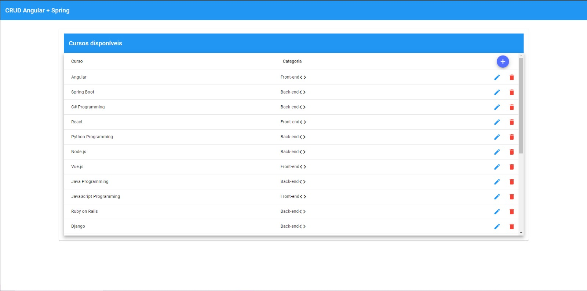
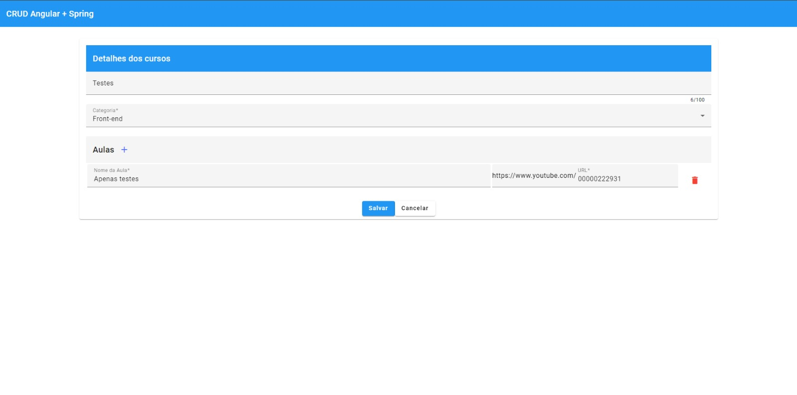
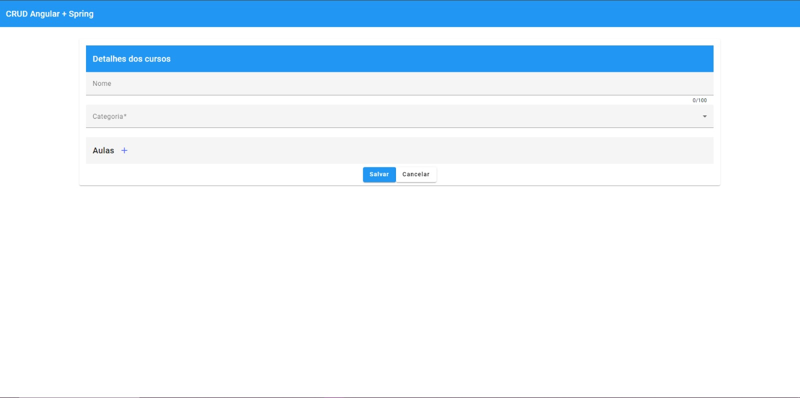

# Project-CRUD-Angular-Spring

Este é um projeto de exemplo de um sistema de gerenciamento de cursos e suas respectivas aulas, desenvolvido com Spring Boot (Java) para o backend e Angular para o frontend. Ele também utiliza o PostgreSQL como banco de dados. O projeto inclui testes unitários para o backend e tem a intenção de adicionar testes de integração e testes unitários para o frontend no futuro.

## Funcionalidades

- Cadastro, atualização e exclusão de cursos.
- Visualização da lista de cursos e seus detalhes.
- Gerenciamento dos cursos.
- Testes unitários para o backend.

## Tecnologias Utilizadas

- **Backend**:
  - Spring Boot (Java): Framework Java para desenvolvimento de aplicativos web.
  - PostgreSQL: Banco de dados relacional para armazenar informações de cursos e aulas.

- **Frontend**:
  - Angular: Framework JavaScript/TypeScript para construção de interfaces de usuário.

- **Testes**:
  - Jasmine e Karma: Frameworks de teste para testes unitários em Angular.(Pelo menos 'e o que eu quero para o projeto)
  - JUnit e Mockito: Frameworks de teste para testes unitários em Spring Boot.

- **Containerização**:
  - Docker: Utilizado para criar containers isolados para o banco de dados PostgreSQL e outras possíveis partes do projeto.

## Como Executar o Projeto

Siga as etapas abaixo para executar o projeto localmente:

1. Clone o repositório do GitHub:

```bash
git clone https://github.com/seu-usuario/seu-projeto.git
cd seu-projeto
```

1.1. Inicialize o Backend:
  - Certifique-se de ter o Java JDK 11 instalado (ou use o Dockerfile para criar uma imagem e depois execute o Docker).
  - Apos isso, pode rodar a aplicação, o servidor estará disponível em http://localhost:8080.

## Documentação com Swagger
A documentação completa da API pode ser encontrada no Swagger. Para acessar a documentação, siga as etapas abaixo:

1. Certifique-se de que o projeto backend está em execução.

2. Abra um navegador da web e vá para a seguinte URL:

   [Swagger API Documentation](http://localhost:8080/swagger-ui/index.html)

   Isso abrirá a interface do Swagger, onde você pode explorar e testar os endpoints da API.


1.2. Inicialize o Frontend:
  - Certifique-se de ter instalado o Angular CLI (ou use o Dockerfile para criar uma imagem e depois execute o Docker).
  - Depois de ter certeza disso, navegue até o diretório onde está o projeto crud_angular (ou o nome que preferir, mas onde está a aplicação frontend) e execute o seguinte comando:
```bash
cd projeto_angular
npm run start/ng serve
```
  - O aplicativo estará disponível em http://localhost:4200.

1.3. Banco de Dados PostgreSQL:
  - Certifique-se de ter o Docker instalado.
  - Em seguida, vá para o diretório /database-docker e execute o seguinte comando:
```bash
cd projeco_backend
cd database-docker
sudo docker-compose up -d
```
  - Isso iniciará um contêiner que executa a imagem do PostgreSQL, que é usada para executar a aplicação com o banco de dados.

## Imagens do Projeto

<!-- <p align="center">
  <span>Imagem da Página Incial</span>
  
</p> -->


- *A Página Inicial é onde você encontrará a lista de cursos disponíveis. Aqui você pode adicionar novos cursos, remover cursos existentes e editar as informações dos cursos, como nome e categoria.*

<!-- <p align="center">
  <span>Imagem da Página de Edição</span>
  
</p> -->


- *A Página de Edição permite que você faça edições detalhadas nos cursos. Você pode alterar o nome, a categoria e também gerenciar as aulas associadas a cada curso, incluindo adicionar, editar e remover aulas.*

<!-- <p align="center">
  <span>Imagem da Página de Add Cursos</span>
  
</p> -->


- *A Página de Adicionar Curso oferece a funcionalidade de criar novos cursos. Você pode especificar o nome, a categoria do curso e, além disso, adicionar, editar e remover aulas diretamente durante o processo de criação do curso.*


